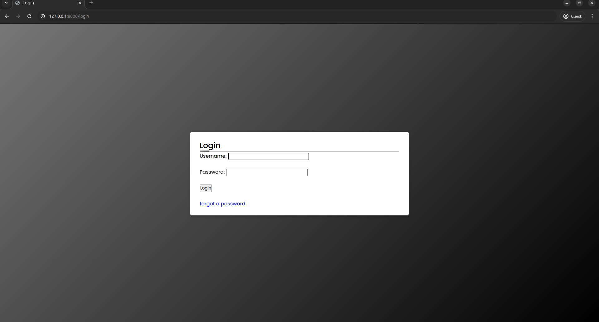
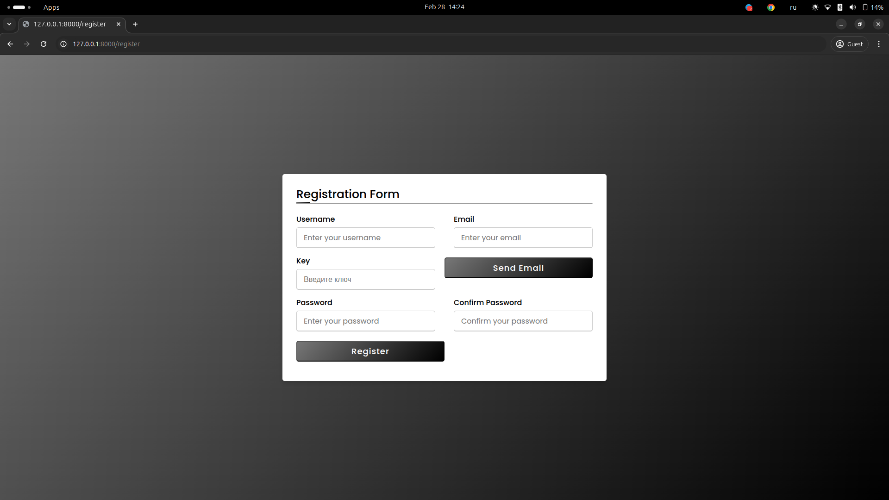
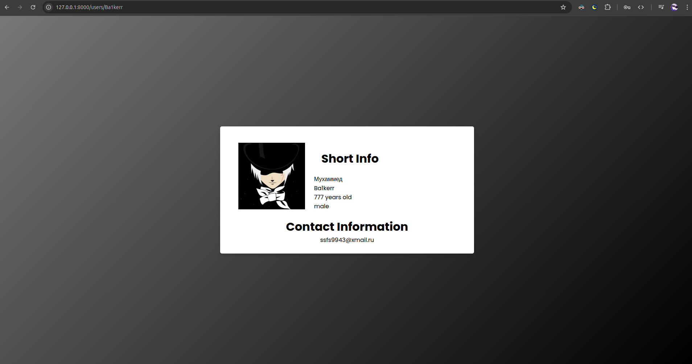

# Dating Site API
## A FastAPI-based dating site API that allows users to create profiles, search for matches, and communicate with each other.

## Features
### User registration and login

## Profile creation and editing
### Search for matches based on location and gender(only getero)

Messaging system for users to communicate with each other
### Integration with PostgreSQL database for storing user data
Support for file uploads and image processing
Support for email notifications and password reset
# Requirements
### Python 3.7+
### FastAPI 0.65.0+
### PostgreSQL 12.4+
## Python libraries:

fastapi
uvicorn
psycopg2
jwt
pydantic
## Installation
pip install -r requirements.txt
## Running the application
1. git clone https://github.com/Ba1Kerrr/Dating_site.git
2. cd Dating_site
3. enter your email,database route and brevo api key in .env file
4. uvicorn app.main:app --reload
# Dating Site API

### API Endpoints

* **User   Endpoints**
	+ `POST /users`: Create a new user
	+ `GET /users/{user_id}`: Get a user's profile
	+ `PUT /users/{user_id}`: Update a user's profile
	+ `DELETE /users/{user_id}`: Delete a user's profile
* **Match Endpoints**
	+ `GET /matches`: Get a list of matches for a user
	+ `POST /matches`: Create a new match
	+ `GET /matches/{match_id}`: Get a match's details
	+ `PUT /matches/{match_id}`: Update a match's details
	+ `DELETE /matches/{match_id}`: Delete a match
* **Message Endpoints**
	+ `GET /messages`: Get a list of messages for a user
	+ `POST /messages`: Create a new message
	+ `GET /messages/{message_id}`: Get a message's details
	+ `PUT /messages/{message_id}`: Update a message's details
	+ `DELETE /messages/{message_id}`: Delete a message

### Database Schema

| Таблица | Описание |
| --- | --- |
| users | Stores user information |
| matches | Stores match information |
| messages | Stores message information |

### Acknowledgments

* This project was built using the following technologies:
	+ FastAPI
	+ PostgreSQL
	+ Python
	+ Pydantic
	+ SQLAlchemy

### API Documentation

* The API documentation is available at `/docs`.
* The documentation includes information on the API endpoints, parameters, and response formats.

### API Endpoints Table

| Endpoint | Method | Description |
| --- | --- | --- |
| `/users` | `POST` | Create a new user |
| `/users/{user_id}` | `GET` | Get a user's profile |
| `/users/{user_id}` | `PUT` | Update a user's profile |
| `/users/{user_id}` | `DELETE` | Delete a user's profile |
| `/matches` | `GET` | Get a list of matches for a user |
| `/matches` | `POST` | Create a new match |
| `/matches/{match_id}` | `GET` | Get a match's details |
| `/matches/{match_id}` | `PUT` | Update a match's details |
| `/matches/{match_id}` | `DELETE` | Delete a match |
| `/messages` | `GET` | Get a list of messages for a user |
| `/messages` | `POST` | Create a new message |
| `/messages/{message_id}` | `GET` | Get a message's details |
| `/messages/{message_id}` | `PUT` | Update a message's details |
| `/messages/{message_id}` | `DELETE` | Delete a message |

### Contact

* If you have any questions or need help with the API, please contact us at `/contact`.

### License

* This project is licensed under the MIT License.
* See `LICENSE` for more information.

### Contributing

* Contributions are welcome!
* Please submit a pull request with your changes.
* Make sure to include a clear description of your changes and any relevant tests.